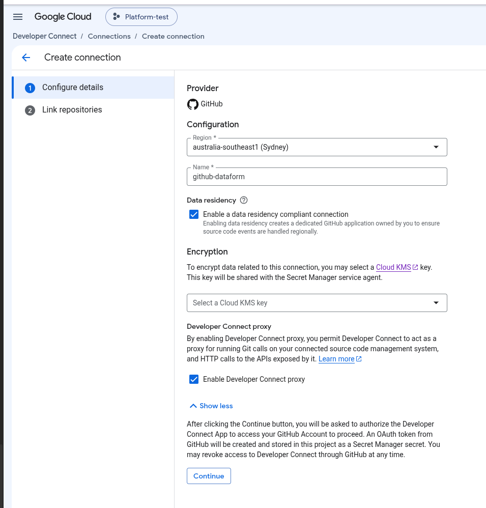
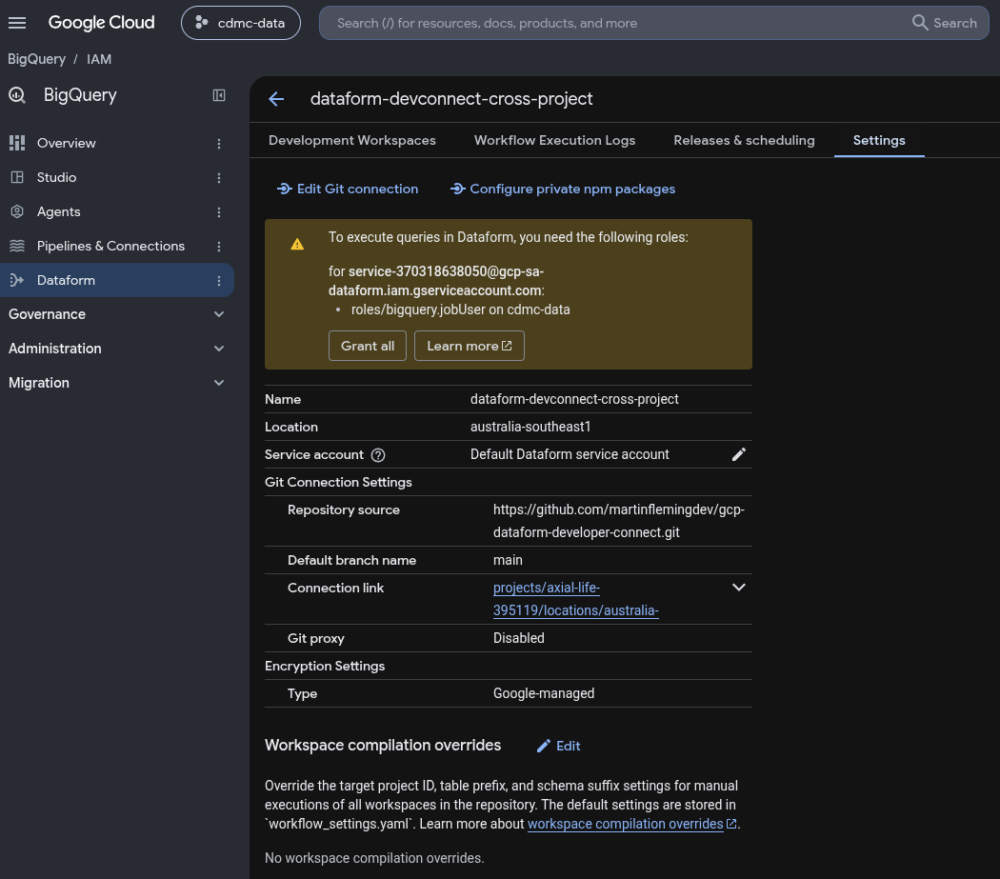
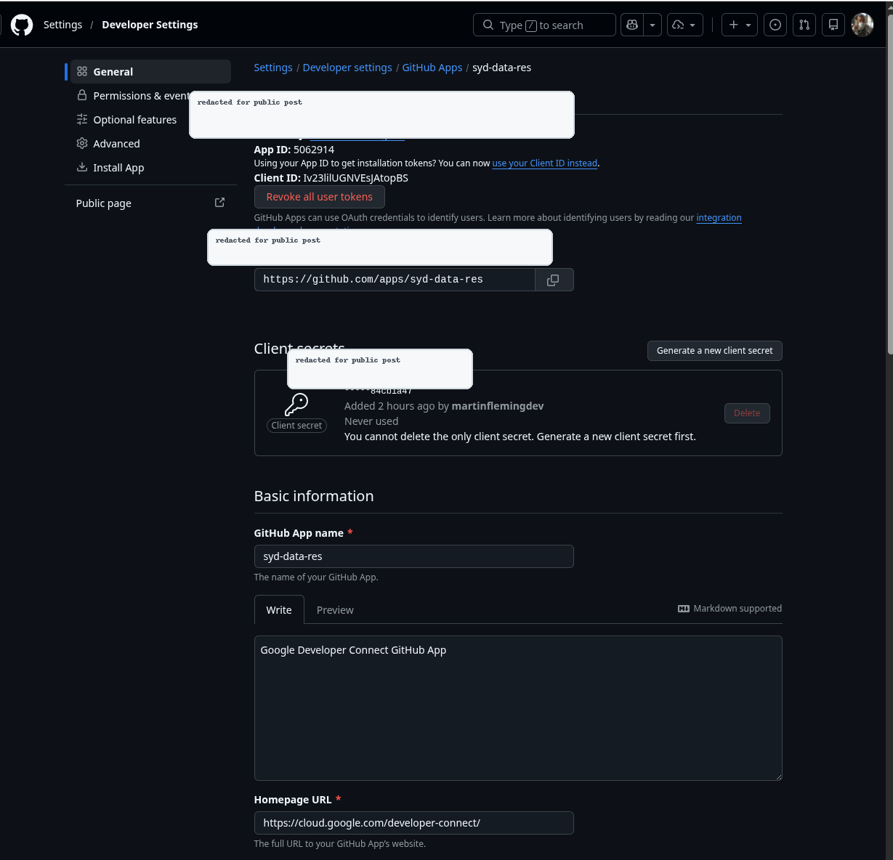
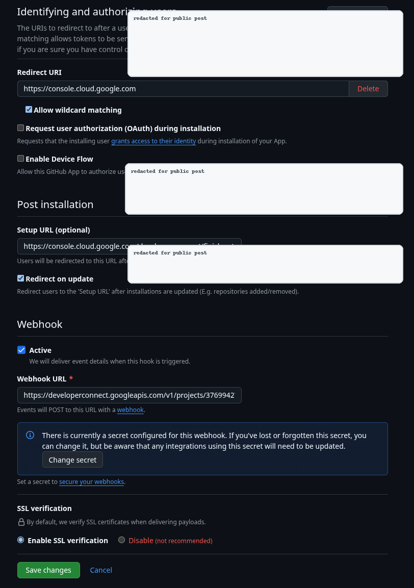
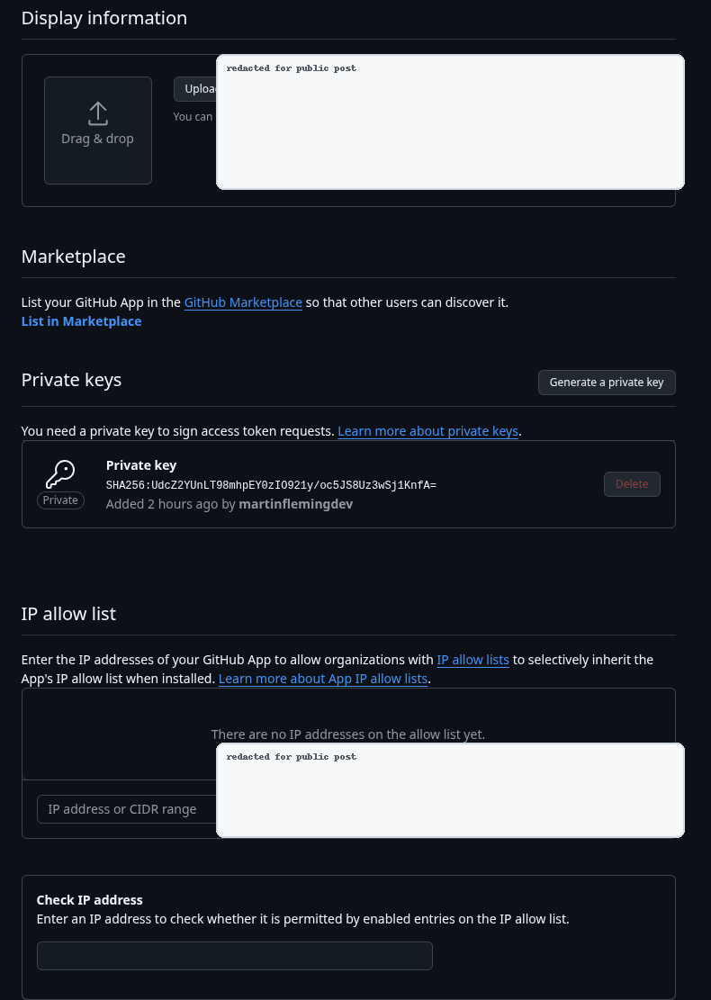
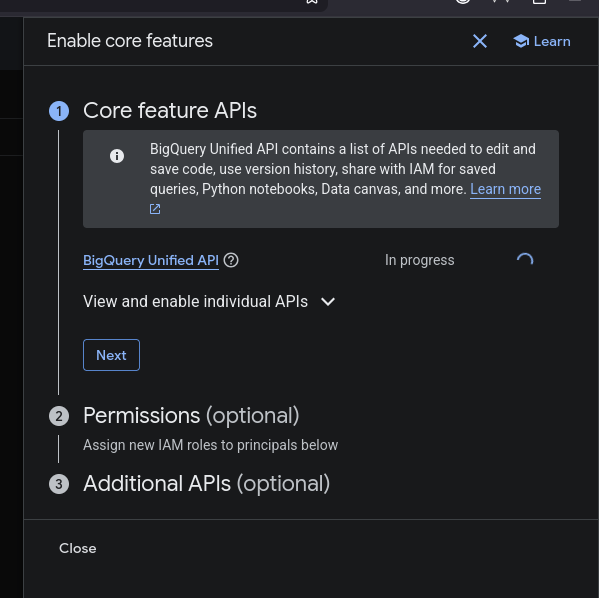
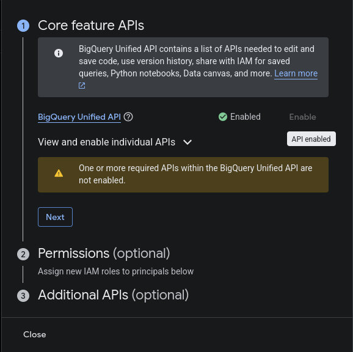
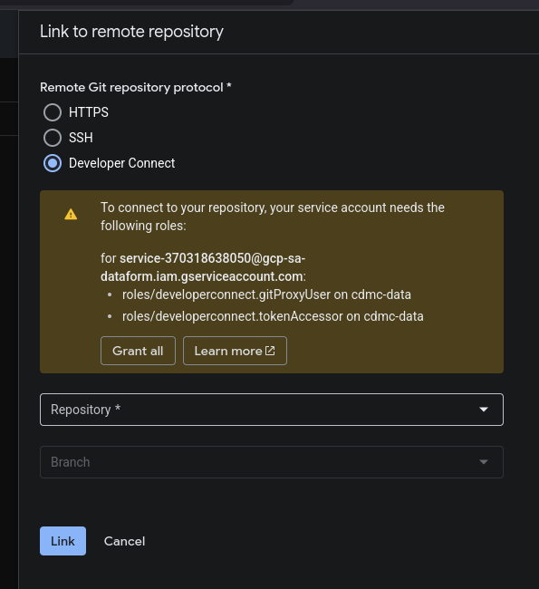

# Connecting BigQuery Dataform to GitHub with Developer Connect, GitHub Apps, and Crossplane

I wanted a concrete answer to a deceptively simple enterprise question: if multiple Google Cloud projects use BigQuery Dataform, and the company wants those Dataform repositories connected to GitHub through Developer Connect, do we need a separate Developer Connect connection and a separate GitHub App in every project?

The short answer from this POC is: **Developer Connect connections are project- and region-scoped, but a Dataform repository in another project can reference a central Developer Connect GitRepositoryLink by full resource name.** The Google Cloud console did not make that path obvious. The API and Crossplane accepted it.

That matters because it gives platform teams a cleaner operating model:

1. A platform project owns the Developer Connect connection.
2. The platform project owns the GitRepositoryLink resources under that connection.
3. App projects own their own Dataform repositories.
4. Dataform repositories reference the platform GitRepositoryLink by full resource name.
5. The app project's Dataform service agent gets IAM on the platform project/link.
6. BigQuery execution IAM stays separate.

This post walks through what I tested, what worked, what failed, and the exact Crossplane resources that made the cross-project setup work.



## The setup

The lab used two Google Cloud projects:

| Role | Project |
| --- | --- |
| Platform project | `platform-project-id` |
| Consuming project | `consumer-project-id` |

The GitHub repository was:

```text
https://github.com/your-org/your-dataform-repo
```

The platform project created a Developer Connect connection in Sydney:

```text
projects/platform-project-id/locations/australia-southeast1/connections/syd-data-res-crossplane
```

Then it created a GitRepositoryLink under that connection:

```text
projects/platform-project-id/locations/australia-southeast1/connections/syd-data-res-crossplane/gitRepositoryLinks/your-org-your-dataform-repo
```

The consuming project created a Dataform repository that referenced that platform-owned link:

```text
projects/consumer-project-id/locations/australia-southeast1/repositories/dataform-devconnect-cross-project
```

That final resource is the important one. The Dataform repository lives in `consumer-project-id`, but its Git remote is backed by a Developer Connect GitRepositoryLink in `platform-project-id`.



## What the region field means

The Developer Connect connection has a region. GitHub does not.

That distinction is easy to miss in the UI. A GitHub repository is not in `australia-southeast1`, and the GitHub App is not in `australia-southeast1`. The region is about Google's Developer Connect resource handling: connection/link metadata, credential references, and regional handling for the data-residency-compliant event path.

For this POC, selecting Sydney meant the Developer Connect connection and GitRepositoryLink lived in `australia-southeast1`. It did not mean GitHub became regional, and it did not force BigQuery datasets or Dataform workflow execution into that region.

Dataform location, BigQuery dataset location, and Developer Connect connection location are related architecture decisions, but they are not the same thing.

## What the GitHub App is doing

When data residency is enabled for a Developer Connect GitHub connection, the console walks you through creating or using a dedicated GitHub App.

The GitHub App is the identity Developer Connect uses to access repositories. The important fields are:

| GitHub App field | Meaning |
| --- | --- |
| App ID | Numeric identifier for the GitHub App. Not a secret. |
| Client ID | OAuth identifier. Not a secret by itself. |
| Client secret | OAuth secret. Different from the private key. Do not expose it. |
| Private key | Server-to-server GitHub App credential used to mint installation tokens. This is sensitive. |
| Webhook URL | Where GitHub sends app/repo events. In this POC it points to Developer Connect. |
| Webhook secret | Shared secret for validating webhook payload signatures. Separate from the private key and client secret. |
| Private key SHA/fingerprint | A fingerprint, not the private key. It cannot reconstruct the key, but I would still redact it from public docs. |







The GitHub App must be installed on each GitHub repository that Developer Connect needs to access. That repository installation step is separate from creating the Dataform repository.

For an enterprise rollout, I would not want personal ownership of this app. The app should be owned by the company's GitHub organization or enterprise platform owner, with clear ownership for private key rotation, webhook configuration, and repository installation approvals.

## The API prerequisites

For the consuming Dataform project, the explicit API prerequisites for this POC were:

```text
bigquery.googleapis.com
dataform.googleapis.com
developerconnect.googleapis.com
```

The platform project also needs the APIs required for Developer Connect and Secret Manager, because it owns the connection and the GitHub App credential references.

The console surfaced this through the BigQuery/Dataform onboarding panels, but for infrastructure-as-code I would make these explicit.





## The Crossplane connection

Here is the Crossplane-managed Developer Connect connection. The POC reused the GitHub App and installation created during the console test.

```yaml
apiVersion: developerconnect.gcp.upbound.io/v1beta1
kind: ConnectConnection
metadata:
  name: syd-data-res-crossplane
  annotations:
    crossplane.io/external-name: syd-data-res-crossplane
spec:
  deletionPolicy: Delete
  providerConfigRef:
    name: default
  forProvider:
    project: platform-project-id
    location: australia-southeast1
    githubEnterpriseConfig:
      hostUri: https://github.com
      appId: "GITHUB_APP_ID"
      appInstallationId: "GITHUB_APP_INSTALLATION_ID"
      privateKeySecretVersion: projects/PLATFORM_PROJECT_NUMBER/locations/australia-southeast1/secrets/developer-connect-github-app-private-key/versions/latest
      webhookSecretSecretVersion: projects/PLATFORM_PROJECT_NUMBER/locations/australia-southeast1/secrets/developer-connect-github-webhook-secret/versions/latest
```

In a production write-up, I would sanitize the exact app ID, installation ID, and Secret Manager resource names. They are not the private key, but they are operational metadata.

The key point is that the manifest does not embed the private key or webhook secret. It references Secret Manager versions.

## The GitRepositoryLink

The GitRepositoryLink is the resource Dataform actually points at.

```yaml
apiVersion: developerconnect.gcp.upbound.io/v1beta1
kind: ConnectGitRepositoryLink
metadata:
  name: your-org-your-dataform-repo
  annotations:
    crossplane.io/external-name: your-org-your-dataform-repo
spec:
  deletionPolicy: Delete
  providerConfigRef:
    name: default
  forProvider:
    project: platform-project-id
    location: australia-southeast1
    parentConnectionRef:
      name: syd-data-res-crossplane
    cloneUri: https://github.com/your-org/your-dataform-repo.git
```

This lives under the platform connection. It does not live in every app project.

## Same-project Dataform repository

First I tested the simple case: Dataform repository and Developer Connect link in the same project.

```yaml
apiVersion: dataform.gcp.upbound.io/v1beta1
kind: Repository
metadata:
  name: dataform-devconnect-same-project
  annotations:
    crossplane.io/external-name: dataform-devconnect-same-project
spec:
  forProvider:
    project: platform-project-id
    region: australia-southeast1
    displayName: Dataform Developer Connect same-project POC
    gitRemoteSettings:
      url: https://github.com/your-org/your-dataform-repo.git
      defaultBranch: main
      gitRepositoryLink: projects/platform-project-id/locations/australia-southeast1/connections/syd-data-res-crossplane/gitRepositoryLinks/your-org-your-dataform-repo
```

That worked.

## Cross-project Dataform repository

Then I tested the part the console did not make obvious: a Dataform repository in `consumer-project-id` using a GitRepositoryLink in `platform-project-id`.

```yaml
apiVersion: dataform.gcp.upbound.io/v1beta1
kind: Repository
metadata:
  name: dataform-devconnect-cross-project
  annotations:
    crossplane.io/external-name: dataform-devconnect-cross-project
spec:
  forProvider:
    project: consumer-project-id
    region: australia-southeast1
    displayName: Dataform Developer Connect cross-project POC
    gitRemoteSettings:
      url: https://github.com/your-org/your-dataform-repo.git
      defaultBranch: main
      gitRepositoryLink: projects/platform-project-id/locations/australia-southeast1/connections/syd-data-res-crossplane/gitRepositoryLinks/your-org-your-dataform-repo
```

That also worked, once the IAM was correct.

The conclusion is blunt: **the console picker is not the full product capability.** The API accepted a full cross-project GitRepositoryLink.

## The IAM that made cross-project work

There are three separate IAM paths. Mixing them together makes this setup harder to reason about.

### 1. The consuming project's Dataform service agent needs access to the platform link

The consuming project has a Google-managed Dataform service agent:

```text
service-<CONSUMING_PROJECT_NUMBER>@gcp-sa-dataform.iam.gserviceaccount.com
```

For `consumer-project-id`, that was:

```text
service-<CONSUMING_PROJECT_NUMBER>@gcp-sa-dataform.iam.gserviceaccount.com
```

That principal needs Developer Connect permissions on the platform project, because the connection and GitRepositoryLink live there:

```yaml
apiVersion: cloudplatform.gcp.upbound.io/v1beta2
kind: ProjectIAMMember
metadata:
  name: consumer-project-id-dataform-developerconnect-token-accessor
spec:
  forProvider:
    project: platform-project-id
    role: roles/developerconnect.tokenAccessor
    member: serviceAccount:service-<CONSUMING_PROJECT_NUMBER>@gcp-sa-dataform.iam.gserviceaccount.com
---
apiVersion: cloudplatform.gcp.upbound.io/v1beta2
kind: ProjectIAMMember
metadata:
  name: consumer-project-id-dataform-developerconnect-git-proxy-user
spec:
  forProvider:
    project: platform-project-id
    role: roles/developerconnect.gitProxyUser
    member: serviceAccount:service-<CONSUMING_PROJECT_NUMBER>@gcp-sa-dataform.iam.gserviceaccount.com
```

The important line is this:

```yaml
project: platform-project-id
```

That is intentional. The grant is on the platform project, not the consuming project.



### 2. The IaC identity needs permission to create Dataform repositories in the consuming project

Crossplane also needed permission to create the Dataform repository in `consumer-project-id`.

```yaml
apiVersion: cloudplatform.gcp.upbound.io/v1beta2
kind: ProjectIAMMember
metadata:
  name: crossplane-provider-dataform-admin-consumer-project-id
spec:
  forProvider:
    project: consumer-project-id
    role: roles/dataform.admin
    member: serviceAccount:crossplane@platform-project-id.iam.gserviceaccount.com
```

Without this, the create failed with `dataform.repositories.create` denied.

This is separate from Developer Connect access. This IAM grant is about allowing the controller to create the Dataform resource in the consuming project.

### 3. The Dataform execution identity still needs BigQuery permissions

Developer Connect IAM only covers Git access. It does not grant BigQuery execution access.

The Dataform execution identity still needs normal BigQuery permissions, such as:

```text
roles/bigquery.jobUser
```

and dataset/table access as appropriate.

## The proxy question

Developer Connect has a Git proxy option. It changes the network path.

With proxy disabled, Dataform reaches the Git host directly using Developer Connect credentials. If the Git host is public GitHub with no IP allow list, this can work fine. If the company has GitHub Enterprise IP allowlisting, this maps to Dataform regional egress allowlisting.

With proxy enabled, Dataform reaches the Developer Connect proxy, and the proxy reaches the Git host. The Git host sees the Developer Connect proxy or private-connectivity path, not normal direct Dataform egress.

That matters because the allowlist question changes. If the company says “allowlist Dataform IPs,” that implies a direct Dataform egress model. If the company wants the Developer Connect proxy, the allowlist target is not simply the Dataform egress IP table.

One provider gap showed up here: the Crossplane Developer Connect CRD and the current Terraform provider schema did not expose `gitProxyConfig` for the connection. The console-created connection had proxy enabled by default. The Crossplane-created connection did not include proxy configuration, so I treated it as proxy disabled unless a separate `gcloud` or API step enables it.

A workaround is:

```bash
gcloud alpha developer-connect connections update syd-data-res-crossplane \
  --project=platform-project-id \
  --location=australia-southeast1 \
  --git-proxy-config-enabled
```

## What I would vend to app teams

For app onboarding, the platform team should provide:

- The region.
- The full GitRepositoryLink resource name.
- Confirmation that the GitHub App is installed on the target repository.
- Confirmation that the app project's Dataform service agent has Developer Connect IAM on the platform project/link.
- The chosen network model: direct Dataform egress or Developer Connect proxy/private connectivity.

The app team still owns:

- Its Dataform repository resource.
- Its Dataform development workflow.
- Its BigQuery execution IAM.
- Its dataset/table access model.

## Final takeaways

Here is the shortest version of the POC result:

- Developer Connect connections are project- and region-scoped.
- There is no folder-level Developer Connect connection.
- A Dataform repository can use a Developer Connect GitRepositoryLink from another project if it references the full resource name.
- The console did not make this obvious, but the API and Crossplane accepted it.
- The consuming project's Dataform service agent needs Developer Connect roles on the platform project/link.
- The IaC identity needs Dataform permissions in the consuming project.
- BigQuery execution IAM is separate.
- The GitHub App can be centrally owned, but it must be installed on each repository that Dataform needs to access.
- Proxy versus direct Git access is a real enterprise networking decision, not a cosmetic checkbox.

This is enough for a platform pattern: centralize the Developer Connect connection and GitHub App ownership, vend GitRepositoryLink resource names per repo/region, and let app teams create Dataform repositories in their own projects with the correct service-agent IAM.

## References

- Dataform repository creation: https://docs.cloud.google.com/dataform/docs/create-repository
- Dataform Git repository integration: https://docs.cloud.google.com/dataform/docs/connect-repository
- Developer Connect GitHub setup: https://docs.cloud.google.com/developer-connect/docs/connect-github-repo
- Developer Connect data residency: https://docs.cloud.google.com/developer-connect/docs/data-residency
- Developer Connect Git proxy: https://docs.cloud.google.com/developer-connect/docs/configure-git-proxy
- GitHub App private keys: https://docs.github.com/en/apps/creating-github-apps/authenticating-with-a-github-app/managing-private-keys-for-github-apps
- GitHub webhook validation: https://docs.github.com/en/webhooks/using-webhooks/validating-webhook-deliveries
